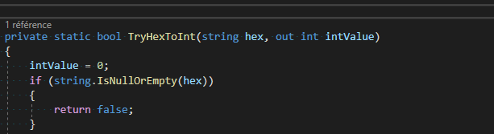
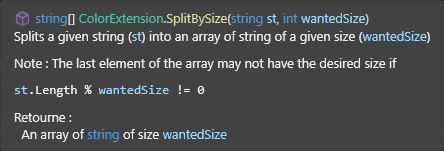

# Normes de code

## Table des matières

- [Table des matières](#table-des-matières)
- [I - Rédaction du code](#i---rédaction-du-code)
  - [1 - Langue d'usage](#1---langue-dusage)
  - [2 - Ordre des déclarations](#2---ordre-des-déclarations)
  - [3 - Longueur des lignes](#3---longueur-des-lignes)
  - [4 - Utilisation des membres sérialisés](#4---utilisation-des-membres-sérialisés)
  - [5 - Encodage des fichiers](#5---encodage-des-fichiers)
  - [6 - Fins de ligne](#6---fins-de-ligne)
  - [7 - Espacements](#7---espacements)
    - [a - Espacements des déclarations de méthode](#a---espacements-des-déclarations-de-méthode)
    - [b - Espacements des appels de méthode](#b---espacements-des-appels-de-méthode)
    - [c - Espacements des crochets, délimiteurs et opérateurs](#c---espacements-des-crochets-délimiteurs-et-opérateurs)
    - [d - Autres espacements](#d---autres-espacements)
  - [8 - Nouvelles lignes](#8---nouvelles-lignes)
  - [9 - Retraits](#9---retraits)
- [II - Utilisation de this](#ii---utilisation-de-this)
- [III - Règles de nomage](#iii---règles-de-nomage)
  - [1 - Types](#1---types)
  - [2 - Variables membres](#2---variables-membres)
    - [a - Publics](#a---publics)
    - [b - Privés et protégés](#b---privés-et-protégés)
    - [c - Constante](#c---constante)
    - [d - Statiques](#d---statiques)
  - [3 - Fonctions et paramètres](#3---fonctions-et-paramètres)
  - [4 - Régions](#4---régions)
- [IV - Initialiser les champs](#iv---initialiser-les-champs)
- [V - Déplacer le code à l'extérieur des boucles](#v---déplacer-le-code-à-lextérieur-des-boucles)
- [VI - Exécuter le code seulement quand les variables changent](#vi---exécuter-le-code-seulement-quand-les-variables-changent)
- [VII - Utiliser les variables en cache](#vii---utiliser-les-variables-en-cache)
- [VIII - Limiter les appels aux fonctions lourdes d'Unity](#viii---limiter-les-appels-aux-fonctions-lourdes-dunity)
- [IX - Limiter l'utilisation des types lourds du C\#](#ix---limiter-lutilisation-des-types-lourds-du-c)
- [X - Utiliser des glossaires](#x---utiliser-des-glossaires)
- [XI - Bonnes habitudes](#xi---bonnes-habitudes)
  - [1 - Le mot clé `var`](#1---le-mot-clé-var)
  - [2 - Ouverture systématique d'accolades](#2---ouverture-systématique-daccolades)
  - [3 - Events](#3---events)
    - [a - Bonnes pratiques avec les events](#a---bonnes-pratiques-avec-les-events)
    - [b - Event Unity ou `delegate` ?](#b---event-unity-ou-delegate)
- [XII - Les commentaires](#xii---les-commentaires)
  - [1 - Forme des commentaires](#1---forme-des-commentaires)
  - [2 - Classes, structs et enums](#2---classes-structs-et-enums)
  - [3 - Méthodes](#3---méthodes)
  - [4 - Variables et accesseurs](#4---variables-et-accesseurs)
  - [5 - Autres commentaires](#5---autres-commentaires)

## I - Rédaction du code

### 1 - Langue d'usage

Le code doit être rédigé en anglais. Les commentaires doivent de préférence être en anglais mais peuvent être en français pour faciliter la lecture aux non anglophones.

### 2 - Ordre des déclarations

La déclaration et l'initialisation de toutes les variables doit être faites au début de la classe, dans un ordre précis :

- Les membres publics statiques
- Les constantes publiques
- Les accesseurs
- Les constantes privées
- Les membres sérialisés privés
- Les membres protégés
- Les membres privés

Il est fortement conseillé d'éviter les variables publiques, utilisez des accesseurs à la place

*Exception : pour les sous-classes ou les `struct`, vous pouvez utiliser des variables publiques afin d'alléger votre code et de faciliter la lecture.*

### 3 - Longueur des lignes

Le C# n'utilisant pas les continuations, il est possible de respecter un certain nombre de caractères par ligne. Veillez donc à éviter les lignes de plus de 120 caractères.

### 4 - Utilisation des membres sérialisés

Afin d'éviter la modification des membres publics, les membres privés sérialisés seront utilisés - `[SerializedField]`

```CSHARP
public class ImageClass
{
    [SerializeField] private Vector2 m_size = Vector2.zero;
    [SerializeField] private float m_filter = 0.0f;
    
    public Vector2 Size { get => m_size; }
    public float Filter { get => m_filter; }
}
```

Pour accéder à ces membres, vous pouvez utiliser des accesseurs.

### 5 - Encodage des fichiers

Tous les scripts créés à partir d'Unity ou manuellement doivent impérativement être encodés en UTF-8, sans signature, afin de conserver les accents.

Veillez donc à vérifier vos fichiers avant de les envoyer !

### 6 - Fins de ligne

Vous devez configurer votre éditeur pour convertir les fins de ligne de vos nouveaux fichiers sous le bon format, à savoir : CR+LF.

> Pour changer le comportement par défaut de l'éditeur :
>
> - Edit > Project Settings, dans la catégorie Editor
> - Bloc Line Endings For New Scripts;
> - CR+LF.

### 7 - Espacements

Les retraits en début de ligne doivent être des espaces, non des tabulations. Attention à bien configurer votre environnement de développement afin qu'il puisse convertir les tabulations en espaces, si nécessaire.

#### a - Espacements des déclarations de méthode

Pas d'espace entre le nom de la méthode et sa parenthèse ouvrante.\
Pas d'espace dans les parenthèses vides de la liste de paramètres.\
Pas d'espace dans les parenthèses de la liste de paramètres.

#### b - Espacements des appels de méthode

Pas d'espace entre le nom de la méthode et sa parenthèse ouvrante.\
Pas d'espace dans les parenthèses vides de la liste d'arguments.\
Pas d'espace dans les parenthèses de la liste d'arguments.

#### c - Espacements des crochets, délimiteurs et opérateurs

Pas d'espace entre les crochets, qu'ils soient vides ou non.\
Insérer un espace avant et après les deux points pour les base et interface dans une déclaration de type.\
Insérer un espace après une virgule.

#### d - Autres espacements

Insérer un espace après les mots clés, tels que :

- `if`
- `else`
- `for`
- `while`
- `switch`
- `catch`

Mais pas d'espaces :

- entre les deux points des étiquettes `case`
- dans les parenthèses d'expressions
- dans les parenthèses de casts de type
- à l'intérieur des parenthèses des instructions
- après les casts.

Exemple :

```CSHARP
// Méthodes
void Goo()
{
    Goo(1);
}
 
void Goo(int x)
{
    Goo();
 
    switch (x)
    {
        case 0:
            Debug.Log("Erreur !");
            break;
        case 1:
            Debug.Log("OK");
            break;
        default:
            break;
    }
}
 
// Boucle for
for (int i = 0; i < x; ++i)
{
}
 
// Expression
float a = (x * x) - ((y - x) * 3);
 
// Cast
int b = (int)c;
 
// Crochets
int[] d = new int[10];
 
// Interface
interface I
{
}
 
class E : I
{
}
 
// Base
public F
{
    public F()
    {
    }
}
 
public class G : F
{
    public G() : base()
    {
    }
}
```

### 8 - Nouvelles lignes

Les accolades doivent être placées sur des nouvelles lignes.

Les mots clés, tels que `else`, `catch` ou `finally` doivent également être placés sur des nouvelles lignes.

Les membres des initialisateurs d'objet et des clauses d'expression de requête doivent être sur une nouvelle ligne.

Exemple :

```CSHARP
// Types
class C
{
    private int m_a = 0;
    private int m_b = 0;
    private int m_d = 0;
     
    // Pour les accesseurs, favorisez l'écriture suivante pour les getters
    public int A => m_a;

    // Et celle ci pour les getters + setters
    public int B { get => m_b; set => m_b = value; }
 
    // Mais celle ci n'est pas gênante non plus
    public int D
    {
        get { return m_d; }
        set { m_d = value; }
    }
     
    // Méthodes
    void Goo(int x)
    {
        // Condition : if ... else
        if (x < 5)
        {
            x = 0;
        }
        else
        {
            Debug.Log("OK");
        }
    }  
}
 
// Méthodes anonymes
D d = delegate(int x)
{
    return 2 * x;
}
 
// Initialisateurs d'objet
C c = new C()
{
    B = 5;
}
 
List<C> list = new List<C>
{
    ...
}
 
C[] array = new C[]
{
    ...
}
 
 
// Clauses d'expression de requête
int q = from a in e
        from b in e
        select a * b;
```

### 9 - Retraits

Des retraits - tabulations - sont nécessaires afin d'améliorer la lecture du code.

Certains sont obligatoires, comme :

- Les retraits du contenu du case, le `break` notamment
- Les retraits des étiquettes `case`
- Le contenu d'un bloc.

## II - Utilisation de this

Le mot-clé `this` doit être utilisé quand il est utile. Dans les cas où vous êtes déjà dans le corps d'une fonction de la classe référencée, il n'est pas nécessaire - et même sans intérêt - d'utiliser `this`

Exemples de bonne utilisation :

```CSHARP
// Passer un objet comme paramètre dans l'appel d'une fonction
CalcTax(this);
```

## III - Règles de nomage

### 1 - Types

Le nom des types - tels que les classes, les structures, les énumérations - doit être écrit en Pascal Case, à savoir la première lettre de chaque mot en majuscules.

Pour les interfaces, le nom du type se compose d'un i majuscule (I) et du nom de l'interface.

Exemple :
Types

```CSHARP
class ImageClass
{
}

interface IComponent
{
}
 
public enum MyFruitType
{
    Pear,
    Apple,
    Lemon
}
```

### 2 - Variables membres

#### a - Publics

Le nom des membres publics doit être écrit en Pascal Case.

```CSHARP
public int Counter = 0;
```

#### b - Privés et protégés

Le nom des membres privés et protégés se compose du préfixe `m_` et du nom du membre.

```CSHARP
protected string m_name = string.Empty;
private float m_distance = 10.0f;
```

#### c - Constante

Le nom des constantes doit être écrit en majuscule.

```CSHARP
private const string RES_PATH = "C:/Resources";
```

#### d - Statiques

Le nom des membres statiques se compose du préfixe `s_` et du nom du membre.

```CSHARP
private static List<int> s_ignoredValues = new List<int>() 
{
    0, 1, 2, 3, 4
};
```

### 3 - Fonctions et paramètres

Le nom des fonctions doit si possible commencer par un verbe.

Le nom des paramètres doit être écrit en Camel Case, à savoir la première lettre en minuscules et la première lettre des autres mots en majuscules.

Exemple :
Fonctions et paramètres

```CSHARP
private void ApplyAllParameters();
public Level GetCurrentLevel();
 
protected void Multiply(float value);
private Component Copy(Component sourceComponent);
```

### 4 - Régions

Le nom des blocs région doit être écrit en majuscules. Un commentaire peut être placé juste avant l’instruction d’ouverture du bloc. L’utilisation des régions doit être justifiée, ne pas en utiliser pour trois ou quatre lignes.

Exemple :
Régions

```CSHARP
// Accesseurs
#region GETTERS
public int PrefabsCount { get => m_prefabs.Count; }
public float Distance { get => m_distance; set => m_distance = value; }
public Transform Target { get => m_target; }
#endregion
```

## IV - Initialiser les champs

Lors de la déclaration des champs, il est bon de les initialiser en attribuant une valeur qui correspond au type ou une valeur nulle.

Exemple :

```CSHARP
public class Level
{
    // Attention à utiliser le bon format de type
    [SerializeField] private float m_duration = 0.0f; // 0.0f pour les floats
    [SerializeField] private string m_name = string.Empty; // string.Empty : pour les string
     
    private int m_enemyCount = 5;
}
```

## V - Déplacer le code à l'extérieur des boucles

Les boucles sont, dans la plupart des cas, une perte sur l'exécution du code. Surtout si elles sont imbriquées.

Évitez donc de les mettre dans des endroits peu propices à leur utilisation, comme dans les fonctions Update ou préférez les déclencher sur condition.

Exemple :

```CSHARP
protected virtual void Update()
{
    if (exampleBool)
    {
        for (int i = 0; i < myArray.Length; i++)
        {
            ExampleFunction(myArray[i]);
        }
    }
}
```

## VI - Exécuter le code seulement quand les variables changent

Exemple :

```CSHARP
// Le score ne change pas à chaque frame
private int score;
 
// DisplayScore ne devrait donc pas être appelé à chaque frame
void Update()
{
    DisplayScore(score); // À éviter !
}
 
public void IncrementScore(int incrementBy)
{
    score += incrementBy;
    // Il peut être déplacé quand on met à jour le score
    DisplayScore(score);
}
```

## VII - Utiliser les variables en cache

Si votre code appelle à répétition des fonctions qui retournent un résultat puis les rejette, c'est peut-être une occasion de l'optimiser en cachant votre variable.

Attention à l'utilisation de `GameObject.transform`, il peut être utile de le mettre en cache ! (cf. [VIII](#viii---limiter-les-appels-aux-fonctions-lourdes-dunity))

Exemple :

```CSHARP
// ! NON !
void Update()
{
    Renderer myRenderer = GetComponent<Renderer>();
    ExampleFunction(myRenderer);
}
 
// On met en cache le Renderer
private Renderer m_myRenderer;
 
void Start()
{
    // Mise en cache
    m_myRenderer = GetComponent<Renderer>();
}
 
void Update()
{
    // Utilisation
    ExampleFunction(m_myRenderer);
}
```

## VIII - Limiter les appels aux fonctions lourdes d'Unity

L'API d'Unity comprend des fonctions lourdes comme :

- La recherche de `Transform` avec `Find()`
- La recherche d'objet avec `FindObjectOfType()`
- `Vector2.magnitude` et `Vector3.magnitude` utilise les racines carrées
- `Vector2.Distance` et `Vector3.Distance` utilisent `magnitude`
- `Camera.main`, utilise des fonctions similaires à `Find()`
- `GameObject.transform`, utilise un `GetComponent<Transform>()`.

## IX - Limiter l'utilisation des types lourds du C\#

Certains types du C# peuvent poser des problèmes d’optimisation car leur temps d’exécution est lourd comme:

- Les listes à savoir `List<T>`, préférez des tableaux (`T[]`) ou encore des dictionnaires quand le cas se présente.

## X - Utiliser des glossaires

Afin d'accélérer l'exécution de votre code, vous pouvez déclarer vos chaînes de caractères dans des glossaires pour éviter la création de ces dernières en boucle.

Afin d'optimiser l'affichage de vos éditeurs personnalisés et d'améliorer leur fluidité, vous pouvez déclarer vos étiquettes, noms de champs, etc. dans des constantes privées ou faire un glossaire des différents champs.

Exemple :

```CSHARP
public static class EditorGlossary
{
    public static const string BUTTON_NAME = "Button";
    public static const string SLIDER = "Slider";
    public static const string LEVEL_0 = "Level0";
}
 
public static class InputGlossary
{
    public static const string JUMP_INPUT= "Jump";
    public static const string CROUCH_INPUT = "Crouch";
}
```

## XI - Bonnes habitudes

### 1 - Le mot clé `var`

Pour faciliter la relecture du code, il est conseillé d'éviter d'utiliser le mot clé `var` pour remplacer le type d'une variable sauf évidemment si le choix ne se présente pas (utilisation de types anonymes par exemple).

### 2 - Ouverture systématique d'accolades

Ouvrez systématiquement des accolades après un `if`, un `for`, un `while`, etc..., même si il n'y a qu'une seule instruction dedans.

```CSHARP
public static void TestMethod<T>(List<T> list)
{
    // À éviter :
    if (list == null)
        return;

    // Préférez cette écriture :
    if (list == null)
    {
        return;
    }
}
```

### 3 - Events

#### a - Bonnes pratiques avec les events

Pensez bien à vous désabonner de tous les events. Si vous ne savez pas quand vous n'en aurez plus besoin, faites le dans le `OnDestroy()`.

#### b - Event Unity ou `delegate` ?

Évitez d'utiliser les events d'Unity et surtout la possibilité de les serialiser et d'indiquer depuis l'inspecteur quelle(s) fonction(s) doivent être appellées à leur invocation.\
Non seulement, ils sont assez lourds mais rendent surtout la recherche de bugs beaucoup plus compliquée car on ne peut pas savoir en regardant seulement le code par qui la fonction est appelée.

Favorisez l'utilisation des `delegate` (comme `Action`, `Func` ou autres `delegate` customs) qui sont plus légers et dont peut suivre tous les appels depuis le code.

Si toutefois vous avez vraiment besoin d'utiliser la serialisation des events Unity, pensez bien à indiquer dans un commentaire, que la fonction est appellée par un objet exterieur.

## XII - Les commentaires

Nous serons évalué·es sur la qualuté notre code. Il est donc important qu'il soit clair et bien commenté.

### 1 - Forme des commentaires

Pour les commentaires avant les classes, structs, enums, méthodes, variables membres et les accesseurs, le mieux serait d'utiliser les summaries.\
Ce sont des commentaires avec `///`, sur plusieurs lignes et contenant des balises XML. Leur avantage principal est d'être interprêtées par Intellisense qui formatte et affiche les commentaires quand on passe le curseur au dessus de l'élément commenté, et ce, n'importe où dans le code.

Un autre avantage est que VisualStudio génère automatiquement un summary vide avec les catégories à remplir si vous mettez 3 slashs (`///`) juste avant l'élément que vous voulez commenter.



Pour une documentation plus complète sur ces balises XML et leur role, [un lien vers la documentation Microsoft](https://learn.microsoft.com/en-us/dotnet/csharp/language-reference/xmldoc/recommended-tags).

### 2 - Classes, structs et enums

Veillez à systématiquement ajouter une description des classes, structs et enums que vous déclarez.\
Cette description n'a pas besoin d'être très longue.

### 3 - Méthodes

Pour toutes les méthodes marquées comme `public`, `internal` ou `protected`, n'étant pas les messages Unity (`Start()`, `Update()`, `OnCollisionEnter()`, ...), il faudrait systématiquement ajouter un commentaire indiquant le rôle de la méthode, une description de ses éventuels paramètres et de ses éventuelles valeurs de retour.\
C'est d'autant plus important pour les méthodes statiques utilitaires qui peuvent être appelées depuis n'importe où.

Pour les méthodes privées, c'est un peu moins utile sauf si la méthode est très utilisée, a un fonctionnement un peu compliqué ou a un nom qui ne reflète pas complètement son rôle.

Exemple :

```CSHARP
/// <summary>
/// Splits a given string (<paramref name="st"/>) into an array of string of a given size (<paramref name="wantedSize"/>)
/// 
/// <para> Note : The last element of the array may not have the desired size if </para>
/// <code><paramref name="st"/>.Length % <paramref name="wantedSize"/> != 0</code>
/// </summary>
/// 
/// <param name="st">String to split</param>
/// <param name="wantedSize">The size of the strings returned</param>
/// 
/// <returns>An array of <see cref="string"/> of size <paramref name="wantedSize"/></returns>
public static string[] SplitBySize(string st, int wantedSize)
{
    int whereIndex = 0;
    int selectIndex = 0;
    int stringLen = st.Length;
    return st.Where((char c) => whereIndex++ % wantedSize == 0)
                .Select((char c) => st.Substring(
                    selectIndex * wantedSize, 
                    Math.Clamp(stringLen - (selectIndex++ * wantedSize), 0, wantedSize)))
                .ToArray();
}
```

donne le résultat suivant quand on passe le curseur au dessus de la méthode :



### 4 - Variables et accesseurs

Il n'est pas obligatoire (et même déconseillé pour la lisibilité) de mettre des commentaires sur toutes les variables mais il est préférable de commenter les variables (membres ou non) qui sont très utilisées ou dont le nom ne reflète pas totalement l'utilisation

*NB : Préférez les summaries (commentaires commençant par `///` et avec des balises XML) pour les variables membres et les accesseurs pour que la personne qui en aura besoin plus tard n'ai pas à aller à la déclaration de la variable mais puisse utiliser Intellisense comme sur l'image précédente*

### 5 - Autres commentaires

N'hésitez pas à ajouter plus de commentaires pour détailler le comportement de votre code. Faîtes cependant attention à ce que ça soit justifié et aide vraiment la personne qui relie le code à le comprendre.

Exemple de mauvaise utilisation des commentaires :

```CSHARP
public static void UselessCommentsMethod()
{
    int counter = 0;

    // Loops 10 times
    while(counter < 10)
    {
        DoStuff(counter);

        // counter is incremented
        counter++;
    }
}
```
